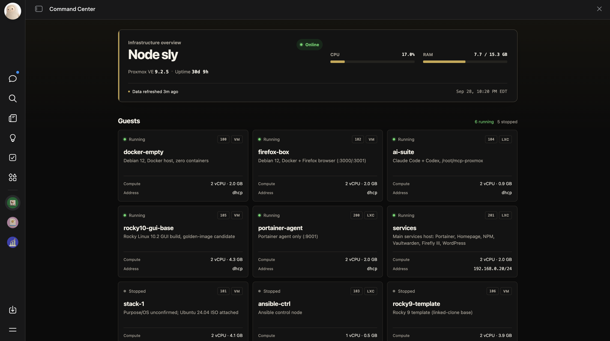
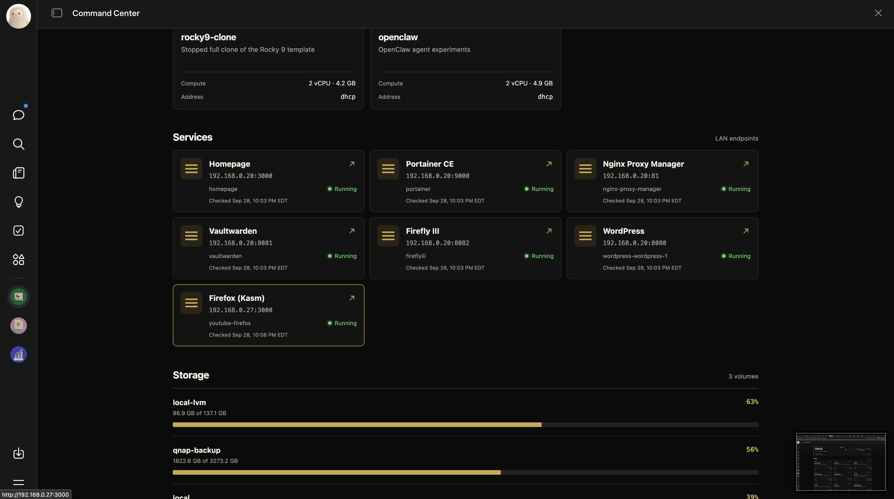

# Homelab Command Center

One dashboard for an entire Proxmox homelab: node health, every guest, service launchers, and storage — refreshed hourly from the Proxmox API.

Built in one evening. Full build log: **[I Built a Command Center for My Entire Homelab](https://slybuilds.substack.com/p/i-built-a-command-center-for-my-entire)**




## How it works

`proxmox-snapshot.py` pulls node status, QEMU/LXC inventories, and storage from the Proxmox API and emits a single JSON snapshot. A dashboard page renders whatever snapshot it holds — the page never talks to Proxmox directly. A cron job runs the script hourly and pushes the result.

## Setup

1. Create a Proxmox API token: **Datacenter → Permissions → API Tokens**. Uncheck **Privilege Separation** (with it on and no explicit permissions, every request 403s — and a 403 looks exactly like a wrong key).
2. Export your credentials:
   ```sh
   export PROXMOX_URL="https://your-proxmox:8006/api2/json"
   export PROXMOX_TOKEN="PVEAPIToken=root@pam!your-token-id=your-secret"
   export PROXMOX_NODE="your-node-name"
   ```
3. Edit the `roles` dict and `raw_services` list in `proxmox-snapshot.py` to match your guests.
4. Run it: `python3 proxmox-snapshot.py`

## The honesty rule

The hourly job only refreshes what the API can see. Container states inside LXCs can't self-refresh (no guest-agent `exec` endpoint for containers), so every service entry carries a `state_checked_at` timestamp from the last manual `pct exec` verification. A dashboard that can't distinguish stale from live is decoration.

## Files

- `proxmox-snapshot.py` — the snapshot collector
- `article.md` — the full build log (also on Substack)
- `images/` — screenshots from the real build
